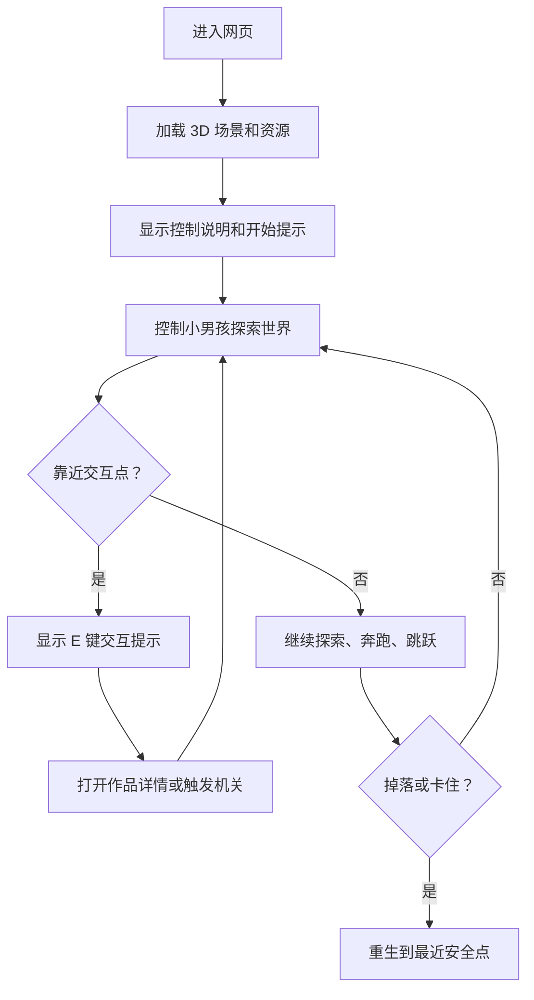

## 1. 产品概述
一个受 Bruno Simon 作品集启发的 3D 网页探索游戏，玩家控制一个可行走、奔跑、跳跃的小男孩，在玩具沙盘式世界中探索项目展台、机关和隐藏区域。
- 主要目标是把传统作品集变成可游玩的交互体验，适合个人作品展示、创意简历、品牌展示或互动 Demo。
- 核心价值是用低门槛浏览器体验制造记忆点：角色探索、物理互动、弹窗介绍、音效反馈和成就收集。

## 2. 核心功能

### 2.1 功能模块
1. **3D 游戏主页**：全屏 Three.js 场景、小男孩主角、探索地图、作品展台。
2. **角色控制系统**：键盘行走、奔跑、跳跃、转向、落地检测、重生。
3. **交互展示系统**：靠近展台显示提示，按键打开作品详情卡片。
4. **游戏化反馈系统**：收集星星、触发成就、跳跃平台、机关反馈。
5. **设置与帮助系统**：控制说明、音效开关、画质切换、重置位置。

### 2.2 页面详情
| 页面名称 | 模块名称 | 功能描述 |
| --- | --- | --- |
| 3D 游戏主页 | 场景画布 | 渲染低多边形沙盘世界、道路、草地、项目展台、装饰物和隐藏区域 |
| 3D 游戏主页 | 小男孩角色 | 支持站立、行走、奔跑、跳跃、空中下落和重生 |
| 3D 游戏主页 | 相机系统 | 第三人称跟随相机，平滑追随角色并保持良好视角 |
| 3D 游戏主页 | 互动提示 | 角色靠近作品点、机关或传送点时显示操作提示 |
| 3D 游戏主页 | 作品弹窗 | 展示项目标题、描述、标签、预览图和访问按钮 |
| 3D 游戏主页 | HUD | 显示收集数量、当前区域、操作提示和成就通知 |
| 3D 游戏主页 | 设置菜单 | 提供音效开关、画质切换、重生、控制说明 |

## 3. 核心流程
用户进入页面后加载 3D 世界，使用键盘控制小男孩探索。靠近项目展台时出现交互提示，按 `E` 打开项目详情。玩家可以收集星星、跳跃到平台、触发机关，并在卡住或掉落时重生到最近安全点。

## 4. 用户界面设计

### 4.1 设计风格
- 主色调：温暖草绿色、天空蓝、奶油白、木质棕，强调玩具沙盘和童话冒险感。
- 辅助色：番茄红、金黄色、深靛蓝，用于交互提示、成就和重要按钮。
- 按钮风格：厚重圆角、轻微 3D 浮起、描边和阴影，像实体玩具牌。
- 字体风格：标题使用手写感或圆润展示字体，正文使用易读圆体风格。
- 布局风格：Canvas 全屏，HUD 悬浮在四角，弹窗采用深色半透明面板与明亮边框。
- 图标风格：简洁线性图标与小徽章结合，避免写实复杂图标。

### 4.2 页面设计概览
| 页面名称 | 模块名称 | UI 元素 |
| --- | --- | --- |
| 3D 游戏主页 | HUD | 左上角收集计数、右上角菜单按钮、底部中央交互提示 |
| 3D 游戏主页 | 控制提示 | 半透明键位卡片，展示 WASD、Shift、Space、E、R |
| 3D 游戏主页 | 项目弹窗 | 项目名称、类型标签、简介、亮点列表、访问按钮、关闭按钮 |
| 3D 游戏主页 | 成就通知 | 右侧滑入的小卡片，带金色星星与音效反馈 |
| 3D 游戏主页 | 设置菜单 | 音效、画质、重生、重置收集、控制说明 |

### 4.3 响应式
桌面优先设计，主要支持键盘操作。移动端保留自适应布局，并预留虚拟摇杆和跳跃按钮的扩展空间。低性能设备自动降低阴影、像素比和后处理强度。

### 4.4 3D 场景指导
- 环境氛围：低多边形玩具沙盘，天空渐变、草地岛屿、木牌、跳台、项目展柜。
- 灯光设置：半球光提供柔和环境色，方向光提供清晰角色阴影。
- 相机设置：第三人称跟随，位于角色后上方，转向时平滑插值。
- 构图焦点：角色始终位于画面下方偏中，交互点使用发光环和浮动标签提示。
- 交互动画：角色移动时身体轻微摆动，跳跃压缩回弹，收集物旋转漂浮。
- 后处理效果：轻量 Bloom、色彩饱和、暗角和柔和阴影，优先保证性能。
- 资产来源：MVP 阶段使用程序化几何体搭建角色和场景，后续可替换为 Blender 导出的 GLB 角色与动画。
- 性能预算：桌面端保持 60 FPS，模型面数控制在轻量级，动态刚体数量少于 30 个。
