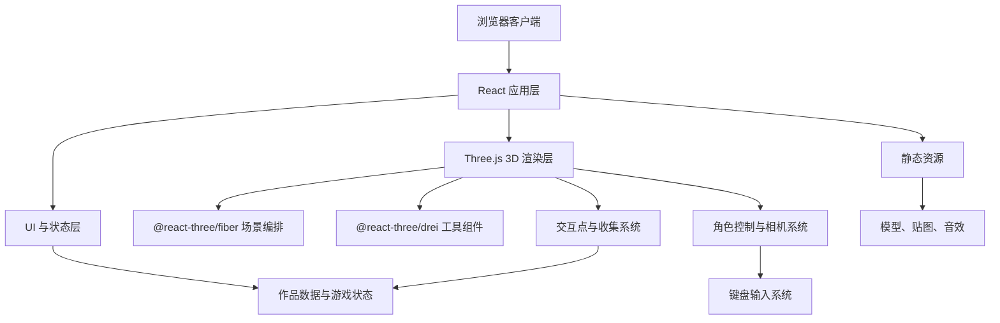

## 1. 架构设计



本项目采用纯前端架构，不依赖后端服务。MVP 版本用程序化几何体搭建小男孩、场景、作品展台和收集物，降低资产依赖并快速交付可玩的体验。

## 2. 技术描述
- 前端：React@18 + TypeScript + Vite。
- 3D 渲染：three + @react-three/fiber + @react-three/drei。
- 后处理：@react-three/postprocessing，MVP 使用轻量 Bloom 和色彩调整。
- 状态管理：React hooks + 轻量自定义 store，管理角色状态、收集数量、弹窗和设置。
- 动画：React Three Fiber 帧循环、Three.js 插值、CSS 动画。
- 物理方案：MVP 使用自定义角色控制器和简单 AABB/距离检测；后续可升级为 Rapier 角色控制器。
- 音频方案：原生 HTMLAudioElement 或 Web Audio 封装，支持音效开关。
- 初始化工具：Vite。
- 后端：无。
- 数据库：无，作品数据使用本地 TypeScript mock 数据。

## 3. 路由定义
| 路由 | 用途 |
| --- | --- |
| `/` | 3D 游戏主页，包含完整游戏场景、HUD、弹窗和设置菜单 |

## 4. 模块设计
| 模块 | 文件建议 | 职责 |
| --- | --- | --- |
| 应用入口 | `src/App.tsx` | 组合 Canvas、HUD、弹窗和菜单 |
| 3D 场景 | `src/game/GameScene.tsx` | 创建灯光、地面、装饰、角色、交互点 |
| 角色控制 | `src/game/BoyController.tsx` | 处理行走、奔跑、跳跃、重力、落地和重生 |
| 相机跟随 | `src/game/FollowCamera.tsx` | 平滑跟随角色并保持第三人称视角 |
| 交互点 | `src/game/InteractivePoint.tsx` | 展台提示、触发范围、浮动标签 |
| 收集物 | `src/game/Collectible.tsx` | 星星旋转、拾取检测、成就触发 |
| 状态管理 | `src/store/gameStore.ts` | 管理游戏状态、作品弹窗、设置、收集进度 |
| 数据配置 | `src/data/projects.ts` | 本地作品列表和展台位置 |
| UI 层 | `src/components/*.tsx` | HUD、项目弹窗、控制说明、设置菜单 |

## 5. 关键类型定义

```ts
export type ProjectItem = {
  id: string
  title: string
  category: string
  description: string
  highlights: string[]
  url: string
  position: [number, number, number]
}

export type PlayerState = {
  position: [number, number, number]
  velocity: [number, number, number]
  isGrounded: boolean
  isRunning: boolean
  nearestRespawn: [number, number, number]
}

export type GameSettings = {
  muted: boolean
  quality: 'low' | 'high'
}
```

## 6. 角色控制方案
- 输入：`WASD` 控制移动，`Shift` 奔跑，`Space` 跳跃，`E` 交互，`R` 重生。
- 移动：基于向量方向计算水平速度，奔跑时速度提升。
- 跳跃：仅在落地时允许触发，施加向上初速度。
- 重力：每帧累加垂直速度，落到地面高度后归零。
- 转向：角色朝移动方向平滑旋转，避免瞬间转身。
- 动画感：程序化摆臂、身体起伏、跳跃压缩回弹，MVP 不依赖骨骼动画。

## 7. 交互与碰撞方案
- 地面：MVP 使用高度为 0 的平面和少量平台高度规则。
- 项目展台：用距离检测判断角色是否进入交互半径。
- 收集物：用距离检测触发拾取并播放粒子/音效反馈。
- 掉落检测：角色 `y` 低于阈值时自动重生。
- 机关扩展：后续可加入移动平台、弹跳垫、传送门和简单推箱子。

## 8. 资源与性能策略
- MVP 阶段使用几何体角色和场景，避免外部模型阻塞开发。
- 所有几何体尽量复用材质，减少 draw call。
- 阴影只开启主角和关键物体，低画质关闭后处理和高分辨率阴影。
- 像素比限制为 `Math.min(window.devicePixelRatio, 2)`，低画质降为 `1`。
- 远处装饰物保持静态，后续大规模重复物体使用 `InstancedMesh`。

## 9. 视觉方向
整体采用“童话玩具沙盘”风格：圆润几何、厚实阴影、温暖色彩、漂浮文字标签和带手作感的 UI。小男孩是记忆点，使用大头、短腿、背包和红色围巾等夸张特征，即使没有复杂模型也能形成角色辨识度。
